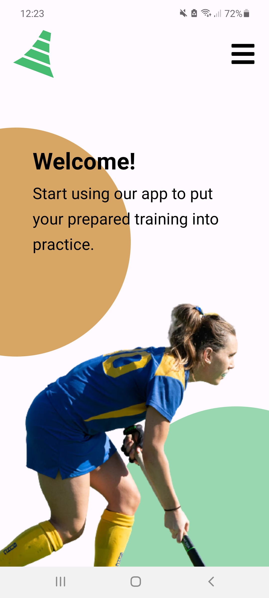
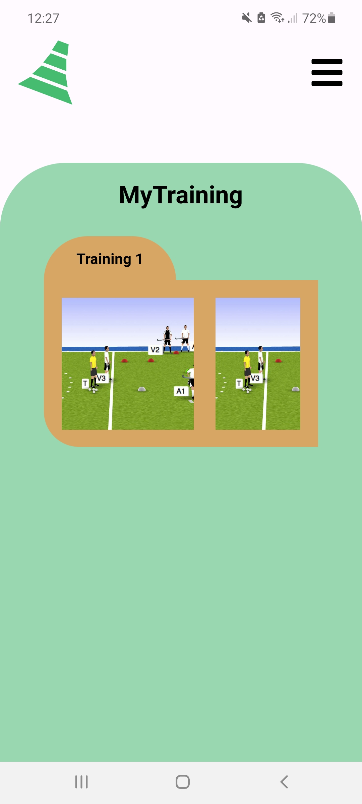
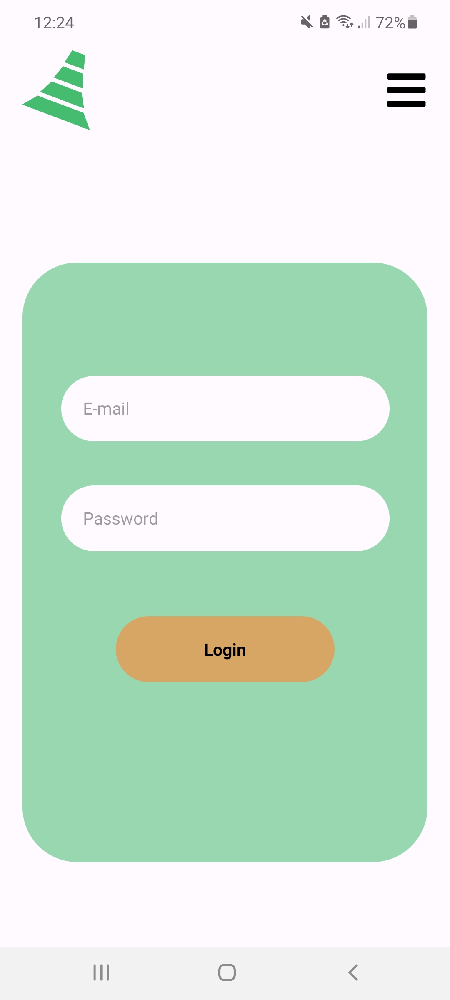
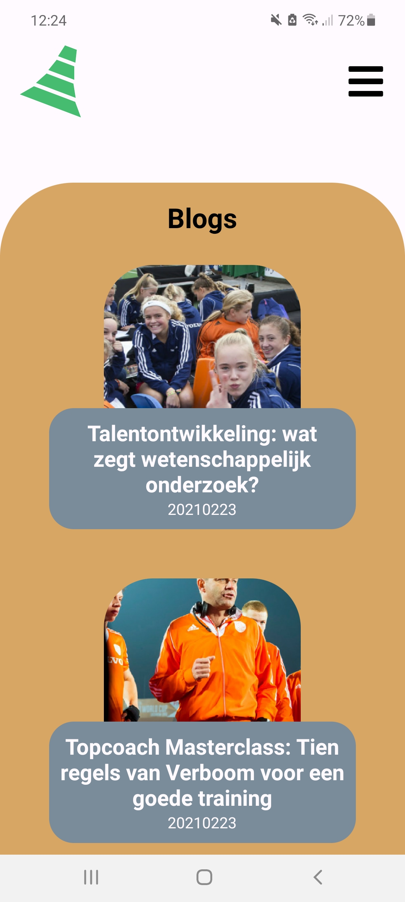

# Plyos-native-app

De Plyos native app is een uitbreiding op de plyos webapplicatie. De mobiele variant is te gebruiken door zowel niet-geregistreerde als geregistreerde bezoekers. In de native app kunnen gebruikers blogs lezen, contact formulieren versturen en inloggen op hun account. Eenmaal ingelogd kunnen de bezoekers ook hun gemaakte trainingen inzien.

### Homepage

### Training

### Login

### Blogs

## Benodigdheden
Naast een editor en een terminal zijn er slechts één benodigdheid vereist om met dit project aan de slag te kunnen. Download en installeer NodeJS, volg de instructies op de [website](https://nodejs.org/en/). 

## Installatie
Nadat het project van Github is gecloned naar een lokale map, is er slechts één stap nodig voordat het gestart kan worden:  
npm install

## Gebruikers
Om in te loggen kan via de webapplicatie een gebruiker worden aangemaakt. Tevens kan gebruik worden gemaakt van een aantal testgebruikers:  
Email: gebruiker1@test.nl    -      Wachtwoord: 1234Qwer  
Email: gebruiker2@test.nl    -      Wachtwoord: 1234Qwer  
Email: gebruiker3@test.nl    -      Wachtwoord: 1234Qwer  

## Beschikbare scripts
In dit project zijn drie scripts standaard beschikbaar. Deze zullen hieronder toegelicht worden.

### `expo start`
Met dit script wordt het project gestart. Automatisch worden de Expo DevTools gestart. Vanuit hier kan gekozen worden via welk platform de applicatie geopend wordt. Als alternatief voor 'expo start' kan ook gekozen worden voor de volgende scripts:
#### `android`
Om het project op andriod te openen.
#### `ios`
Om het project op iOS te starten.
#### `web`
Niet aangeraden. Start het project in een webbrowser.

### `npm test`
Kan gebruikt worden om de applicatie te testen. In de huidige versie zijn echter geen test opgenomen. 

### `expo eject`
Wanneer de ontwikkelaar niet met expo wil werken, kan dit commanda gebruikt worden om de applicatie verder te ontwikkelen zonder expo.
Hiermee verliest de programmeur voordelen als het automatisch linken van libaries. 
